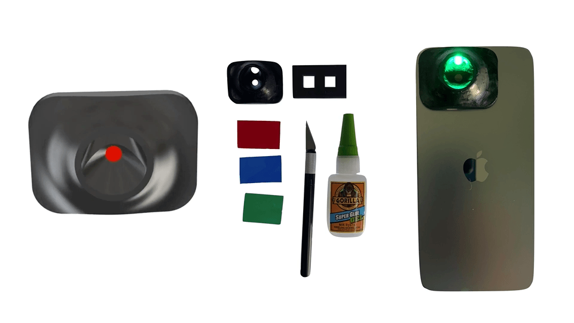

CF-Cam 
===========
Ultracompact fluorescence smartphone attachment using built-in optics for protoporphyrin-IX quantification in skin.
*Biomedical Optics Express*

[Journal Link](https://doi.org/10.1364/BOE.439342) | [Demo](https://doi.org/10.6084/m9.figshare.15104967.v1) | [Cite](#reference) 



## Issues
- Please report all issues on the public forum.

## License
© [Optics in Medicine Lab](https://sites.dartmouth.edu/optmed/) - This code is made available under the GPLv3 License and is available for non-commercial academic purposes. 

## Reference
If you find our work useful in your research or if you use parts of this code please consider citing our [paper](https://doi.org/10.1364/BOE.439342):
```
@article{hunt_ultracompact_2021,
	title = {Ultracompact fluorescence smartphone attachment using built-in optics for protoporphyrin-{IX} quantification in skin},
	issn = {2156-7085, 2156-7085},
	url = {https://www.osapublishing.org/boe/abstract.cfm?doi=10.1364/BOE.439342},
	doi = {10.1364/BOE.439342},
	language = {en},
	urldate = {2021-10-18},
	journal = {Biomedical Optics Express},
	author = {Hunt, Brady and Streeter, Samuel and Ruiz, Alberto and Chapman, M. Shane and Pogue, Brian},
	month = oct,
	year = {2021},
}
```
